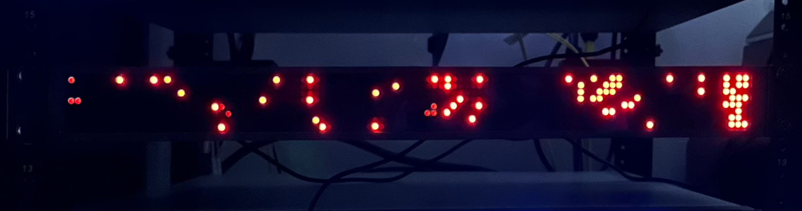

# ledload



A load monitor using an array of thirteen 8x8 LED display modules.

This repository contains the source code, electronic schematics, and 3D models used to build and run this device.

A journal tracking the development of this project can be found in this [imgur post](https://imgur.com/a/led-load-display-pLlge7e).

## models

The [models](https://github.com/glhughes123/ledload/tree/main/models) directory contains all of the designs and models for the enclosure parts and LED alinment jig.

### FreeCAD projects

| File | Description |
| ---- | ----------- |
| [led alignment plate.FCStd](https://github.com/glhughes123/ledload/blob/main/models/led%20alignment%20plate.FCStd) | LED alignment jig |
| [led rack mount.FCStd](https://github.com/glhughes123/ledload/blob/main/models/led%20rack%20mount.FCStd) | Rack-mountable enclosure |

### 3MF files

| File | Description |
| ---- | ----------- |
| [led alignment plate-6 leds w_ notches and edge.3mf](https://github.com/glhughes123/ledload/blob/main/models/led%20alignment%20plate-6%20leds%20w_%20notches%20and%20edge.3mf) | 6-module half of the LED alignment jig |
| [led alignment plate-7 leds w_ notches and edge.3mf](https://github.com/glhughes123/ledload/blob/main/models/led%20alignment%20plate-7%20leds%20w_%20notches%20and%20edge.3mf) | 7-module half of the LED alignment jig |

| File | Description |
| ---- | ----------- |
| [led rack mount-panel 001 bottom with pins.3mf](https://github.com/glhughes123/ledload/blob/main/models/led%20rack%20mount-panel%20001%20bottom%20with%20pins.3mf) | Bottom-right panel |
| [led rack mount-panel 001 top with pins.3mf](https://github.com/glhughes123/ledload/blob/main/models/led%20rack%20mount-panel%20001%20top%20with%20pins.3mf) | Top-left panel |
| [led rack mount-panel 002 bottom with pins.3mf](https://github.com/glhughes123/ledload/blob/main/models/led%20rack%20mount-panel%20002%20bottom%20with%20pins.3mf) | Bottom-left panel |
| [led rack mount-panel 002 top with pins.3mf](https://github.com/glhughes123/ledload/blob/main/models/led%20rack%20mount-panel%20002%20top%20with%20pins.3mf) | Top-right panel |
| [led rack mount-backplate with ethernet.3mf](https://github.com/glhughes123/ledload/blob/main/models/led%20rack%20mount-backplate%20with%20ethernet.3mf) | Rear-left panel with cutouts for USB-C and RJ45 Ethernet |
| [led rack mount-backplate with fans.3mf](https://github.com/glhughes123/ledload/blob/main/models/led%20rack%20mount-backplate%20with%20fans.3mf) | Rear-right panel with cutouts for two 40mm fans |
| [led rack mount-backplate joiner.3mf](https://github.com/glhughes123/ledload/blob/main/models/led%20rack%20mount-backplate%20joiner.3mf) | Plate to join the rear panel halves together |
| [led rack mount-front with bezel.3mf](https://github.com/glhughes123/ledload/blob/main/models/led%20rack%20mount-front%20with%20bezel.3mf) | Half of the front panel with cutout for the LED modules |
| [led rack mount-dowel.3mf](https://github.com/glhughes123/ledload/blob/main/models/led%20rack%20mount-dowel.3mf) | Dowel to join the front bezel halves together |
| [led rack mount-side.3mf](https://github.com/glhughes123/ledload/blob/main/models/led%20rack%20mount-side.3mf) | Side panel |
| [led rack mount-squared peg.3mf](https://github.com/glhughes123/ledload/blob/main/models/led%20rack%20mount-squared%20peg.3mf) | Internal support peg |
| [led rack mount-front center tab.3mf](https://github.com/glhughes123/ledload/blob/main/models/led%20rack%20mount-front%20center%20tab.3mf) | Tab to keep pressure on LED alignment jig against front bezel |
| [led rack mount-rpi4 mount.3mf](https://github.com/glhughes123/ledload/blob/main/models/led%20rack%20mount-rpi4%20mount.3mf) | Platform to mount RPI 4 onto bottom panel grid |
| [led rack mount-perfboard mount.3mf](https://github.com/glhughes123/ledload/blob/main/models/led%20rack%20mount-perfboard%20mount.3mf) | Platform to mount perfboard onto bottom of panel grid |
| [led rack mount-clip.3mf](https://github.com/glhughes123/ledload/blob/main/models/led%20rack%20mount-clip.3mf) | Clip to mount circuit boards to platforms |

## building the LED alignment jig

Required parts:
- Superglue

Instructions:
1. Glue the 6-element and 7-element LED alignment jig halves together.

## building half of the box

Required parts:
- Superglue
- M3 socket-head screws (6mm, 12mm, 16mm) for general assembly
- M3 nuts
- M4 screws for rack ears
- M4 nuts
- [Rack ears](https://www.amazon.com/dp/B0B6TM1LC1)
- [two 40mm x 20mm 5V fans](https://www.amazon.com/dp/B072Q3CMRW)
- [USB-C panel mount extension cable](https://www.datapro.net/products/usb-c-panel-mount-extension-cable.html?search=usb-c+panel)
- [RJ45 Ethernet panel mount extension cable](https://www.datapro.net/products/panel-mount-ethernet-rj45-cat5e-extension-cable.html?search=rj45+panel)

Instructions:
1. Glue the two back panels together with superglue. You can also use the backplate joiner for additional stiffness.
2. Glue two copies of the front bezel panels together with superglue. Use the dowels for alignment and as glue points. Use the previously-assembled LED alignment jig to help with positioning and alignment but do not glue the alignment jig into the front bezel.
3. Screw the two top panels together with 3 short M3 screws. Ensure you attach a "front center tab" with the front-most screw during assembly. 
4. Screw the two bottom panels together with 3 short M3 screws. Ensure you attach a "front center tab" with the front-most screw during assembly.
5. Insert M3 nuts into the slots in the side panels for the bottom and rear panels.
6. Attach the rear panel to the side panels and screw together.
7. Attach the bottom panel to the rear and side panels and screw together. Ensure the eyelets on the rear panel and the pins on the bottom panel line up.
8. Insert M3 nuts into 4 of the "squared pegs" and screw them into the 4 holes in the bottom panel.
9. Screw in the fans, USB-C extension cable, and RJ45 Ethernet cable to the back panel.
10. Place M4 nuts in the holes in the side panels and attach the rack ears.

## building strings of LED modules

Required parts:
- [8x8 LED modules with MAX7219 microcontrollers](https://www.amazon.com/dp/B0BXDJS22V)
- 24 AWG solid-core wire
- 5-pin Dupont male headers

Instructions:
1. Remove the LED displays from the circuit boards. Be careful as they are tightly connected and it's very easy to bend the pins.
2. Solder together a string of 5 circuit boards.
3. Solder together two strings of 4 circuit boards.
4. Solder Dupont headers to the input side of the first circuit board of each string.

## building the buffer circuit

Required parts:
- two 74HC14 inverter ICs
- [Perf board](https://www.amazon.com/dp/B07ZYTZ48N)
- 24 AWG solid-core wire
- 5-pin and 2-pin Dupont male headers

Instructions:
1. Build a buffer circuit following [this schematic](https://github.com/glhughes123/ledload/blob/main/kicad/ledload.schematic.svg).

## inserting LED modules into the alignment jig

Instructions:
1. Organize the LED displays into a string of 13 that align well together. There is some variance in how the LED displays are cut and taking some time here will help the device to look more uniform in the end.
2. Insert the LED displays into the alignment jig. Be careful with aligning the pins; do not force them into the holes. Note the tabs on the top of the LED displays align with notches on one side of the jig.
3. Very carefully, attach the strings of circuit boards to the pins of the LED displays on the other side of the alignment jig. This is a very fiddly process so take your time and be careful not to bend the pins as they are fragile. The string of 5 should be on the left and all input pins should be oriented on the left of each string of circuit boards.

## final assembly

Required parts:
- Superglue
- M3 socket-head screws
- M3 nuts
- Rasbperry Pi 4B
- Wires with female Dupont connectors on both ends

Instructions:
1. Place the alignment jig with the attached LED modules into the front bezel.
2. Insert M3 screws into the slots in the side panels for the front screw holes.
3. Attach the front bezel with the alignment jig to the front of the box. Make sure the rings at the bottom of the bezel align with the pins in the bottom panels.
4. Screw the front bezel in place.
5. Attach the RPI to its mounting plate using either screws or the clips. Attach the RPI mounting plate to the bottom-right panel by aligning the fingers on the bottom of the mounting plate to the grid in the panel. Push down to lock in place.
6. Attach the buffer circuit perf board to its mounting plate and the bottom panel of the case in a similar fashion.
7. Attach wires from the output headers of the buffer circuit to the input headers on the strings of LED modules
- CS0 to the left-most string
- CS1 to the middle string
- CS2 to the right-most string
8. Attach wires from the GPIO pins of the RPI to the input headers of the buffer circuit:
- 5V pin 4 to PWR
- GND pin 6 to GND
- GPIO pin 25 (pin 22) to CS0
- GPIO pin 24 (pin 18) to CS1
- GPIO pin 23 (pin 16) to CS2
- MOSI (pin 19) to DATA
- CLK (pin 13) to CLK
9. Attach wires from the GPIO pins of the RPI to the fans
- Use a fan splitter
- 5V pin 2 to pin 2 of the fan cable (male Dupont connectors fit perfectly)
- GND pin 9 to pin 1 of the fan cable
10. Plug in the USB-C and RJ45 Ethernet cables
11. Place M3 nuts in the slots for the top holes in the side panels and the pegs in the middle of the case. Use superglue to secure them in place as there will otherwise be nothing preventing them from turning when screwing the top panel in place.

## testing

1. Put an SD card in the RPI with whatever Linux-based OS you want to use
2. Plug in the power and let it boot up
3. Build / install the ledload program on the RPI
4. Build / install the ledload program on the client machine whose status you wish to monitor (can also be the same RPI)
5. Run ```ledload -s -l``` on the RPI to start it in LED mode
6. Run ```ledload -c 192.168.0.100``` on the client machine where ```192.168.0.100``` is replaced with the IP of the RPI (must be the IP address)

If all is working well, at this point you should see the LED displays light up and start showing you some load information. Note that the ledload program is built for my 56-core Xeon so you will not see the entire display lit up if you have fewer cores. It's left as an exercise to the reader to modify the program to meet your specific needs.

## buttoning it up

If everything is working as expected, only one step remains:

1. Carefully place the top panel, ensuring its pins align with the rings on the front and back panels. Screw into place.

## feedback

If you've made it this far that's awesome! Thanks for taking an interest in this project; hopefully it's been inspirational.

I'd love to hear from anybody that is using or building on this project or just wants to share their thoughts on it.
